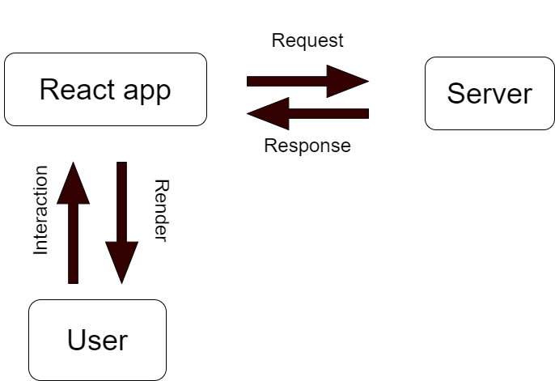

# BITES Bank Project
This is a [Next.js](https://nextjs.org/) project bootstrapped with [`create-next-app`](https://github.com/vercel/next.js/tree/canary/packages/create-next-app).

## Getting Started

First, run the development server.
If you have docker, you may want to run this command:
```bash
docker compose up
```

or if you do not have Docker Desktop application or docker environment on your development environment.

```bash
npm run dev
```

Open [http://localhost:3000](http://localhost:3000) with your browser to see the result.

You can start editing the page by modifying `app/page.js`. The page auto-updates as you edit the file.

This project uses [`next/font`](https://nextjs.org/docs/basic-features/font-optimization) to automatically optimize and load Inter, a custom Google Font.

## User Authentication and Authorization in React



The diagram simply explains what happened and what to expect from a backend service and a React application. It may also be said as traditional life cycle of a product.

Authentication is important to build a secured application. The security vulnerabilities are the last thing that any developer intents to make hence attackers may reach to data of your user. 

### Server
The server must know who are the users are hence it returns responses to these users' requests. It wants to send the data to authenticated or authorized user hence every data from the database of the server should not send to every user for security purposes.
The server has to authenticate every single request who wants to user, identify user and return the response if it has permission as success otherwise no permission.

### Users
The users should not communicate `directly` with the server.

### React App
It must send requests with respect to the `users' interaction`. It acts like a middle man between users and server.

## Tokens
We've two tokens: access token and refresh token. These tokens can be used either in React application or backend service to give authentication and authorization to the user for sending requests and to identify user.

### Refresh Token
The token is created in authentication process. It should not be shared with anybody and stored in cookies which is HTTP only. This means, this cookie cannot be accessed through `Javascript`. This means, only the server will be able to read and set this cookie. React application or any attacker will not be able to see this cookie. **NEVER GOES TO CLIENT**.

### Access Token
It is generated by refresh token. Then, this token is send to `the React application` as response. After that, the React application is responsible for storing and using this token. The access token will give permission to the user to see the services and send request to the server. Moreover, `it must be passed in every request` hence it identifies the who the user is. As long as we have a valid access token, the user can make specified interactions with the React application, and these interactions creates requests, then the server validates the requests hence it is the token of the user. The expiration dates are implemented to the accesss tokens. The cookies or local storage are not secure. The safest place to put this token to a safe place is memory, that means a state. The handling of expired time of the token is a responsibility of `the React application`. However, I was new for authentication at the beginning of my internship, so I decided to use cookies instead of states. I wanted to learn previous technologies and check if I have enough time, I will try to improve security issues.
The useful video to understand this tokens is here: https://youtu.be/AcYF18oGn6Y

## React Hook Form
It is for building complicated and well performed forms in React. It is for avoiding the unnecesarry code implementation in React. It allows developer to handle user experience, and it also allows getting appropriate data from the user with less code considering with actual React library.

The forms are necesarry to communicate properly. They improve our communication quality with sending the request to the right endpoint.

## Gün sonu önerileri
BUTON İÇİN BİR ADET STATE HAZIRLANIP KIRMIZIYA DÖNDÜRÜLEBİLİR INVALİDKEN.
Butonu ayrı bir komponente sarıp, ardından da errors'u bir prop olarak verip bunların iterasyonunda hatalı bir durum varsa o state'i false yapıp, butona class'ı eklenebilir.

Bugün eve gittiğimde en azından 2 saat buna uğraşsam tatlı olabilir bu arada...